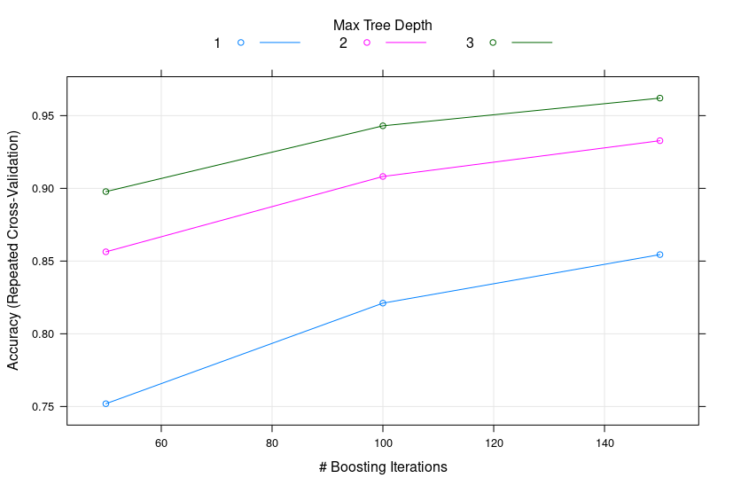

```{r setup, include=FALSE}
knitr::opts_chunk$set(echo = TRUE)
```

## Project Log

Whole logic corresponding to the work is based on a few facts that we need to consider cases where there is no spurious data and filter the irrelevant columns from the dataset. There are a few issues associated with the dataset.

* Issue with Dataset  
  + Presence of "NA"
  + Presence of Null columns
  + Non numeric data are identifiers so needs to dropped from the train and test set 

For prediction, I have a lot of algo to choose as most of them are present in caret package. I went ahead with gbm because of decent performance than random forest regression. 

Testing was performed with three iteration and 5-cross validation. It was meant to ensure that the model should not be biased. 

Finally, the predict method of caret was used to evaluate on the test set. 

Some Information regarding the column selection and accuracy curve is presented below. 

```{r eval=TRUE, echo=FALSE}
# Loading of Data
library('dplyr')
library('caret')
train_data <- read.csv('pml-training.csv')
test <- read.csv('pml-testing.csv')
#  There are some Columns which are just for the identification purpose so these needs to be removed. These columns are listed below
ignore_col <- c("X", "raw_timestamp_part_1", "raw_timestamp_part_2", "num_window" )
```


# Some Stats

```{r eval=TRUE, echo=FALSE}
paste("Total number Columns", length(names(train_data)))
```
```{r eval=TRUE, echo=FALSE}
# Some stats
filter_train <- train_data[, colSums(is.na(train_data)) == 0]
paste("Total Number of columns after NA filter", length(names(filter_train)))
filter_train <- filter_train[,(as.vector(colSums(filter_train== "", na.rm = TRUE) == 0))] # Remove columns with blank spaces
paste("Total Number of columns after Null filter", length(names(filter_train)))
train_x <- dplyr::select_if(filter_train, is.numeric)
train_y <- filter_train$classe
selected_col = names(train_x)[!(names(train_x)==ignore_col)]
train_x <- train_x[, selected_col]
paste("Total Number of columns for training", length(names(filter_train)))
```
### Accuracy and Number of tree plot. 



