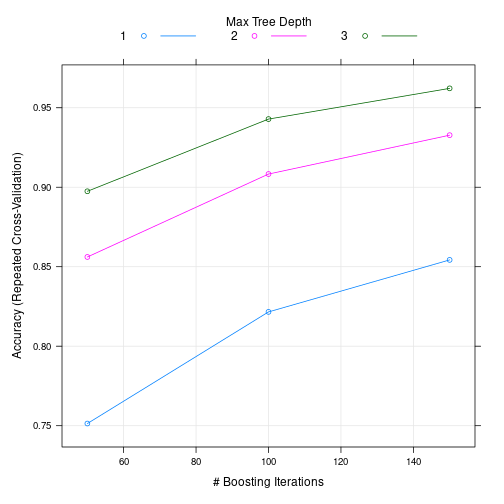
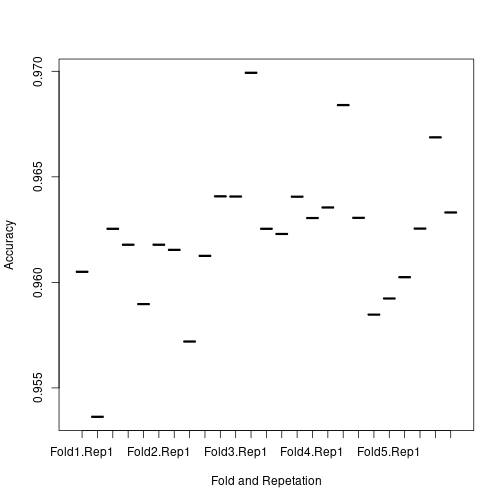

## R Markdown

Whole logic corresponding to the work is based on a few facts that we need to consider cases where there is no spurious data and filter the irrelevant columns from the dataset. There are a few issues associated with the dataset.

* Issue with Dataset  
  + Presence of "NA"
  + Presence of Null columns
  + Non numeric data are identifiers so needs to dropped from the train and test set 

For prediction, I have a lot of algo to choose as most of them are present in caret package. I went ahead with gbm because of decent performance than random forest regression. 

Testing was performed with 5 iteration and 5-cross validation. It was meant to ensure that the model should not be biased. 

Finally, the predict method of caret was used to evaluate on the test set. 

Some Information regarding the column selection and accuracy curve is presented below. 


# Some Stats


```
## [1] "Total number Columns 160"
```

```
## [1] "Total Number of columns after NA filter 93"
```

```
## [1] "Total Number of columns after Null filter 60"
```

```
## [1] "Total Number of columns for training 60"
```
### Accuracy and Number of tree plot. 


```r
# Train Random forest for the prediction 
ctrl <- trainControl(method = "repeatedcv", repeats = 5, number = 5)
set.seed(825)
gbm <- train(x= train_x, y =train_y, method = 'gbm', trControl=ctrl)
```

```
## Iter   TrainDeviance   ValidDeviance   StepSize   Improve
##      1        1.6094            -nan     0.1000    0.1313
##      2        1.5224            -nan     0.1000    0.0877
##      3        1.4633            -nan     0.1000    0.0642
##      4        1.4197            -nan     0.1000    0.0546
##      5        1.3838            -nan     0.1000    0.0443
##      6        1.3553            -nan     0.1000    0.0427
##      7        1.3269            -nan     0.1000    0.0440
##      8        1.3003            -nan     0.1000    0.0320
##      9        1.2797            -nan     0.1000    0.0323
##     10        1.2595            -nan     0.1000    0.0365
##     20        1.1031            -nan     0.1000    0.0161
##     40        0.9341            -nan     0.1000    0.0088
##     60        0.8266            -nan     0.1000    0.0066
##     80        0.7495            -nan     0.1000    0.0059
##    100        0.6877            -nan     0.1000    0.0038
##    120        0.6367            -nan     0.1000    0.0035
##    140        0.5917            -nan     0.1000    0.0024
##    150        0.5724            -nan     0.1000    0.0022
## 
## Iter   TrainDeviance   ValidDeviance   StepSize   Improve
##      1        1.6094            -nan     0.1000    0.1866
##      2        1.4888            -nan     0.1000    0.1292
##      3        1.4047            -nan     0.1000    0.1046
##      4        1.3380            -nan     0.1000    0.0823
##      5        1.2852            -nan     0.1000    0.0710
##      6        1.2406            -nan     0.1000    0.0714
##      7        1.1963            -nan     0.1000    0.0608
##      8        1.1587            -nan     0.1000    0.0593
##      9        1.1230            -nan     0.1000    0.0461
##     10        1.0941            -nan     0.1000    0.0424
##     20        0.8920            -nan     0.1000    0.0182
##     40        0.6797            -nan     0.1000    0.0089
##     60        0.5622            -nan     0.1000    0.0067
##     80        0.4728            -nan     0.1000    0.0055
##    100        0.4064            -nan     0.1000    0.0031
##    120        0.3549            -nan     0.1000    0.0022
##    140        0.3138            -nan     0.1000    0.0020
##    150        0.2953            -nan     0.1000    0.0020
## 
## Iter   TrainDeviance   ValidDeviance   StepSize   Improve
##      1        1.6094            -nan     0.1000    0.2333
##      2        1.4595            -nan     0.1000    0.1614
##      3        1.3566            -nan     0.1000    0.1196
##      4        1.2799            -nan     0.1000    0.1148
##      5        1.2096            -nan     0.1000    0.0833
##      6        1.1553            -nan     0.1000    0.0799
##      7        1.1056            -nan     0.1000    0.0702
##      8        1.0623            -nan     0.1000    0.0622
##      9        1.0218            -nan     0.1000    0.0527
##     10        0.9881            -nan     0.1000    0.0584
##     20        0.7645            -nan     0.1000    0.0278
##     40        0.5380            -nan     0.1000    0.0106
##     60        0.4110            -nan     0.1000    0.0089
##     80        0.3295            -nan     0.1000    0.0043
##    100        0.2686            -nan     0.1000    0.0030
##    120        0.2226            -nan     0.1000    0.0016
##    140        0.1909            -nan     0.1000    0.0013
##    150        0.1774            -nan     0.1000    0.0013
## 
## Iter   TrainDeviance   ValidDeviance   StepSize   Improve
##      1        1.6094            -nan     0.1000    0.1263
##      2        1.5246            -nan     0.1000    0.0858
##      3        1.4673            -nan     0.1000    0.0679
##      4        1.4224            -nan     0.1000    0.0529
##      5        1.3869            -nan     0.1000    0.0479
##      6        1.3556            -nan     0.1000    0.0396
##      7        1.3297            -nan     0.1000    0.0399
##      8        1.3046            -nan     0.1000    0.0332
##      9        1.2830            -nan     0.1000    0.0277
##     10        1.2628            -nan     0.1000    0.0329
##     20        1.1064            -nan     0.1000    0.0166
##     40        0.9356            -nan     0.1000    0.0088
##     60        0.8286            -nan     0.1000    0.0058
##     80        0.7522            -nan     0.1000    0.0050
##    100        0.6863            -nan     0.1000    0.0031
##    120        0.6359            -nan     0.1000    0.0027
##    140        0.5929            -nan     0.1000    0.0029
##    150        0.5730            -nan     0.1000    0.0022
## 
## Iter   TrainDeviance   ValidDeviance   StepSize   Improve
##      1        1.6094            -nan     0.1000    0.1877
##      2        1.4884            -nan     0.1000    0.1268
##      3        1.4060            -nan     0.1000    0.1074
##      4        1.3374            -nan     0.1000    0.0833
##      5        1.2848            -nan     0.1000    0.0713
##      6        1.2392            -nan     0.1000    0.0720
##      7        1.1941            -nan     0.1000    0.0598
##      8        1.1568            -nan     0.1000    0.0565
##      9        1.1210            -nan     0.1000    0.0437
##     10        1.0938            -nan     0.1000    0.0451
##     20        0.8964            -nan     0.1000    0.0235
##     40        0.6890            -nan     0.1000    0.0126
##     60        0.5630            -nan     0.1000    0.0079
##     80        0.4758            -nan     0.1000    0.0054
##    100        0.4067            -nan     0.1000    0.0045
##    120        0.3554            -nan     0.1000    0.0035
##    140        0.3133            -nan     0.1000    0.0028
##    150        0.2935            -nan     0.1000    0.0017
## 
## Iter   TrainDeviance   ValidDeviance   StepSize   Improve
##      1        1.6094            -nan     0.1000    0.2274
##      2        1.4631            -nan     0.1000    0.1636
##      3        1.3600            -nan     0.1000    0.1258
##      4        1.2804            -nan     0.1000    0.1056
##      5        1.2141            -nan     0.1000    0.0878
##      6        1.1592            -nan     0.1000    0.0683
##      7        1.1152            -nan     0.1000    0.0694
##      8        1.0719            -nan     0.1000    0.0681
##      9        1.0296            -nan     0.1000    0.0520
##     10        0.9973            -nan     0.1000    0.0532
##     20        0.7655            -nan     0.1000    0.0266
##     40        0.5377            -nan     0.1000    0.0125
##     60        0.4167            -nan     0.1000    0.0095
##     80        0.3270            -nan     0.1000    0.0032
##    100        0.2695            -nan     0.1000    0.0027
##    120        0.2258            -nan     0.1000    0.0024
##    140        0.1918            -nan     0.1000    0.0020
##    150        0.1794            -nan     0.1000    0.0017
## 
## Iter   TrainDeviance   ValidDeviance   StepSize   Improve
##      1        1.6094            -nan     0.1000    0.1288
##      2        1.5240            -nan     0.1000    0.0867
##      3        1.4659            -nan     0.1000    0.0691
##      4        1.4214            -nan     0.1000    0.0531
##      5        1.3869            -nan     0.1000    0.0433
##      6        1.3583            -nan     0.1000    0.0470
##      7        1.3287            -nan     0.1000    0.0400
##      8        1.3033            -nan     0.1000    0.0337
##      9        1.2819            -nan     0.1000    0.0332
##     10        1.2610            -nan     0.1000    0.0333
##     20        1.1043            -nan     0.1000    0.0190
##     40        0.9335            -nan     0.1000    0.0107
##     60        0.8260            -nan     0.1000    0.0046
##     80        0.7471            -nan     0.1000    0.0044
##    100        0.6842            -nan     0.1000    0.0032
##    120        0.6355            -nan     0.1000    0.0034
##    140        0.5939            -nan     0.1000    0.0033
##    150        0.5735            -nan     0.1000    0.0019
## 
## Iter   TrainDeviance   ValidDeviance   StepSize   Improve
##      1        1.6094            -nan     0.1000    0.1912
##      2        1.4884            -nan     0.1000    0.1295
##      3        1.4056            -nan     0.1000    0.1034
##      4        1.3388            -nan     0.1000    0.0867
##      5        1.2830            -nan     0.1000    0.0753
##      6        1.2360            -nan     0.1000    0.0621
##      7        1.1968            -nan     0.1000    0.0627
##      8        1.1576            -nan     0.1000    0.0526
##      9        1.1244            -nan     0.1000    0.0509
##     10        1.0931            -nan     0.1000    0.0392
##     20        0.8929            -nan     0.1000    0.0194
##     40        0.6818            -nan     0.1000    0.0112
##     60        0.5543            -nan     0.1000    0.0079
##     80        0.4660            -nan     0.1000    0.0069
##    100        0.4005            -nan     0.1000    0.0035
##    120        0.3504            -nan     0.1000    0.0044
##    140        0.3087            -nan     0.1000    0.0021
##    150        0.2902            -nan     0.1000    0.0028
## 
## Iter   TrainDeviance   ValidDeviance   StepSize   Improve
##      1        1.6094            -nan     0.1000    0.2373
##      2        1.4568            -nan     0.1000    0.1650
##      3        1.3543            -nan     0.1000    0.1223
##      4        1.2772            -nan     0.1000    0.1006
##      5        1.2142            -nan     0.1000    0.0886
##      6        1.1589            -nan     0.1000    0.0810
##      7        1.1050            -nan     0.1000    0.0627
##      8        1.0647            -nan     0.1000    0.0704
##      9        1.0217            -nan     0.1000    0.0602
##     10        0.9846            -nan     0.1000    0.0522
##     20        0.7533            -nan     0.1000    0.0233
##     40        0.5327            -nan     0.1000    0.0132
##     60        0.4058            -nan     0.1000    0.0074
##     80        0.3217            -nan     0.1000    0.0042
##    100        0.2653            -nan     0.1000    0.0051
##    120        0.2246            -nan     0.1000    0.0025
##    140        0.1904            -nan     0.1000    0.0017
##    150        0.1760            -nan     0.1000    0.0019
## 
## Iter   TrainDeviance   ValidDeviance   StepSize   Improve
##      1        1.6094            -nan     0.1000    0.1268
##      2        1.5236            -nan     0.1000    0.0864
##      3        1.4666            -nan     0.1000    0.0666
##      4        1.4233            -nan     0.1000    0.0561
##      5        1.3876            -nan     0.1000    0.0519
##      6        1.3543            -nan     0.1000    0.0428
##      7        1.3271            -nan     0.1000    0.0357
##      8        1.3043            -nan     0.1000    0.0343
##      9        1.2828            -nan     0.1000    0.0340
##     10        1.2613            -nan     0.1000    0.0301
##     20        1.1083            -nan     0.1000    0.0163
##     40        0.9418            -nan     0.1000    0.0097
##     60        0.8317            -nan     0.1000    0.0072
##     80        0.7534            -nan     0.1000    0.0061
##    100        0.6885            -nan     0.1000    0.0049
##    120        0.6369            -nan     0.1000    0.0038
##    140        0.5937            -nan     0.1000    0.0022
##    150        0.5738            -nan     0.1000    0.0025
## 
## Iter   TrainDeviance   ValidDeviance   StepSize   Improve
##      1        1.6094            -nan     0.1000    0.1870
##      2        1.4878            -nan     0.1000    0.1256
##      3        1.4057            -nan     0.1000    0.1026
##      4        1.3404            -nan     0.1000    0.0823
##      5        1.2875            -nan     0.1000    0.0729
##      6        1.2414            -nan     0.1000    0.0687
##      7        1.1995            -nan     0.1000    0.0563
##      8        1.1643            -nan     0.1000    0.0605
##      9        1.1271            -nan     0.1000    0.0446
##     10        1.0994            -nan     0.1000    0.0383
##     20        0.9002            -nan     0.1000    0.0230
##     40        0.6883            -nan     0.1000    0.0119
##     60        0.5597            -nan     0.1000    0.0073
##     80        0.4709            -nan     0.1000    0.0056
##    100        0.4051            -nan     0.1000    0.0040
##    120        0.3536            -nan     0.1000    0.0027
##    140        0.3130            -nan     0.1000    0.0036
##    150        0.2962            -nan     0.1000    0.0028
## 
## Iter   TrainDeviance   ValidDeviance   StepSize   Improve
##      1        1.6094            -nan     0.1000    0.2332
##      2        1.4619            -nan     0.1000    0.1562
##      3        1.3625            -nan     0.1000    0.1251
##      4        1.2833            -nan     0.1000    0.0955
##      5        1.2226            -nan     0.1000    0.0972
##      6        1.1610            -nan     0.1000    0.0749
##      7        1.1139            -nan     0.1000    0.0674
##      8        1.0712            -nan     0.1000    0.0655
##      9        1.0318            -nan     0.1000    0.0611
##     10        0.9936            -nan     0.1000    0.0483
##     20        0.7617            -nan     0.1000    0.0223
##     40        0.5343            -nan     0.1000    0.0169
##     60        0.4136            -nan     0.1000    0.0081
##     80        0.3315            -nan     0.1000    0.0040
##    100        0.2732            -nan     0.1000    0.0039
##    120        0.2286            -nan     0.1000    0.0032
##    140        0.1957            -nan     0.1000    0.0023
##    150        0.1819            -nan     0.1000    0.0014
## 
## Iter   TrainDeviance   ValidDeviance   StepSize   Improve
##      1        1.6094            -nan     0.1000    0.1294
##      2        1.5238            -nan     0.1000    0.0902
##      3        1.4656            -nan     0.1000    0.0679
##      4        1.4210            -nan     0.1000    0.0518
##      5        1.3864            -nan     0.1000    0.0442
##      6        1.3565            -nan     0.1000    0.0453
##      7        1.3281            -nan     0.1000    0.0402
##      8        1.3026            -nan     0.1000    0.0315
##      9        1.2828            -nan     0.1000    0.0316
##     10        1.2619            -nan     0.1000    0.0357
##     20        1.1066            -nan     0.1000    0.0171
##     40        0.9374            -nan     0.1000    0.0097
##     60        0.8276            -nan     0.1000    0.0069
##     80        0.7507            -nan     0.1000    0.0043
##    100        0.6850            -nan     0.1000    0.0038
##    120        0.6325            -nan     0.1000    0.0029
##    140        0.5893            -nan     0.1000    0.0026
##    150        0.5706            -nan     0.1000    0.0028
## 
## Iter   TrainDeviance   ValidDeviance   StepSize   Improve
##      1        1.6094            -nan     0.1000    0.1922
##      2        1.4879            -nan     0.1000    0.1279
##      3        1.4066            -nan     0.1000    0.1065
##      4        1.3389            -nan     0.1000    0.0792
##      5        1.2882            -nan     0.1000    0.0728
##      6        1.2417            -nan     0.1000    0.0644
##      7        1.2013            -nan     0.1000    0.0657
##      8        1.1610            -nan     0.1000    0.0611
##      9        1.1229            -nan     0.1000    0.0432
##     10        1.0953            -nan     0.1000    0.0422
##     20        0.8945            -nan     0.1000    0.0204
##     40        0.6793            -nan     0.1000    0.0125
##     60        0.5510            -nan     0.1000    0.0071
##     80        0.4626            -nan     0.1000    0.0059
##    100        0.3981            -nan     0.1000    0.0036
##    120        0.3485            -nan     0.1000    0.0026
##    140        0.3067            -nan     0.1000    0.0024
##    150        0.2896            -nan     0.1000    0.0014
## 
## Iter   TrainDeviance   ValidDeviance   StepSize   Improve
##      1        1.6094            -nan     0.1000    0.2353
##      2        1.4601            -nan     0.1000    0.1638
##      3        1.3569            -nan     0.1000    0.1203
##      4        1.2804            -nan     0.1000    0.1078
##      5        1.2131            -nan     0.1000    0.0908
##      6        1.1576            -nan     0.1000    0.0751
##      7        1.1101            -nan     0.1000    0.0804
##      8        1.0604            -nan     0.1000    0.0591
##      9        1.0232            -nan     0.1000    0.0641
##     10        0.9838            -nan     0.1000    0.0462
##     20        0.7550            -nan     0.1000    0.0203
##     40        0.5287            -nan     0.1000    0.0112
##     60        0.4073            -nan     0.1000    0.0064
##     80        0.3269            -nan     0.1000    0.0051
##    100        0.2685            -nan     0.1000    0.0030
##    120        0.2269            -nan     0.1000    0.0021
##    140        0.1940            -nan     0.1000    0.0025
##    150        0.1795            -nan     0.1000    0.0008
## 
## Iter   TrainDeviance   ValidDeviance   StepSize   Improve
##      1        1.6094            -nan     0.1000    0.1280
##      2        1.5218            -nan     0.1000    0.0881
##      3        1.4640            -nan     0.1000    0.0681
##      4        1.4192            -nan     0.1000    0.0552
##      5        1.3834            -nan     0.1000    0.0419
##      6        1.3556            -nan     0.1000    0.0472
##      7        1.3263            -nan     0.1000    0.0440
##      8        1.2993            -nan     0.1000    0.0373
##      9        1.2753            -nan     0.1000    0.0328
##     10        1.2551            -nan     0.1000    0.0305
##     20        1.0995            -nan     0.1000    0.0160
##     40        0.9317            -nan     0.1000    0.0106
##     60        0.8246            -nan     0.1000    0.0048
##     80        0.7464            -nan     0.1000    0.0049
##    100        0.6823            -nan     0.1000    0.0038
##    120        0.6311            -nan     0.1000    0.0028
##    140        0.5888            -nan     0.1000    0.0036
##    150        0.5689            -nan     0.1000    0.0018
## 
## Iter   TrainDeviance   ValidDeviance   StepSize   Improve
##      1        1.6094            -nan     0.1000    0.1894
##      2        1.4889            -nan     0.1000    0.1334
##      3        1.4042            -nan     0.1000    0.1045
##      4        1.3361            -nan     0.1000    0.0830
##      5        1.2833            -nan     0.1000    0.0710
##      6        1.2376            -nan     0.1000    0.0750
##      7        1.1917            -nan     0.1000    0.0560
##      8        1.1564            -nan     0.1000    0.0562
##      9        1.1209            -nan     0.1000    0.0513
##     10        1.0898            -nan     0.1000    0.0398
##     20        0.8935            -nan     0.1000    0.0244
##     40        0.6845            -nan     0.1000    0.0097
##     60        0.5592            -nan     0.1000    0.0078
##     80        0.4667            -nan     0.1000    0.0047
##    100        0.3989            -nan     0.1000    0.0040
##    120        0.3454            -nan     0.1000    0.0027
##    140        0.3065            -nan     0.1000    0.0019
##    150        0.2897            -nan     0.1000    0.0017
## 
## Iter   TrainDeviance   ValidDeviance   StepSize   Improve
##      1        1.6094            -nan     0.1000    0.2325
##      2        1.4623            -nan     0.1000    0.1599
##      3        1.3588            -nan     0.1000    0.1262
##      4        1.2799            -nan     0.1000    0.1038
##      5        1.2148            -nan     0.1000    0.0957
##      6        1.1547            -nan     0.1000    0.0737
##      7        1.1083            -nan     0.1000    0.0815
##      8        1.0576            -nan     0.1000    0.0579
##      9        1.0203            -nan     0.1000    0.0612
##     10        0.9836            -nan     0.1000    0.0543
##     20        0.7505            -nan     0.1000    0.0240
##     40        0.5259            -nan     0.1000    0.0124
##     60        0.4005            -nan     0.1000    0.0083
##     80        0.3230            -nan     0.1000    0.0045
##    100        0.2655            -nan     0.1000    0.0035
##    120        0.2227            -nan     0.1000    0.0018
##    140        0.1906            -nan     0.1000    0.0013
##    150        0.1773            -nan     0.1000    0.0013
## 
## Iter   TrainDeviance   ValidDeviance   StepSize   Improve
##      1        1.6094            -nan     0.1000    0.1259
##      2        1.5242            -nan     0.1000    0.0869
##      3        1.4664            -nan     0.1000    0.0692
##      4        1.4217            -nan     0.1000    0.0541
##      5        1.3866            -nan     0.1000    0.0454
##      6        1.3570            -nan     0.1000    0.0433
##      7        1.3291            -nan     0.1000    0.0387
##      8        1.3044            -nan     0.1000    0.0369
##      9        1.2815            -nan     0.1000    0.0352
##     10        1.2596            -nan     0.1000    0.0312
##     20        1.1044            -nan     0.1000    0.0199
##     40        0.9341            -nan     0.1000    0.0104
##     60        0.8276            -nan     0.1000    0.0072
##     80        0.7492            -nan     0.1000    0.0057
##    100        0.6873            -nan     0.1000    0.0043
##    120        0.6349            -nan     0.1000    0.0039
##    140        0.5902            -nan     0.1000    0.0031
##    150        0.5714            -nan     0.1000    0.0021
## 
## Iter   TrainDeviance   ValidDeviance   StepSize   Improve
##      1        1.6094            -nan     0.1000    0.1885
##      2        1.4892            -nan     0.1000    0.1305
##      3        1.4045            -nan     0.1000    0.1093
##      4        1.3360            -nan     0.1000    0.0831
##      5        1.2833            -nan     0.1000    0.0716
##      6        1.2388            -nan     0.1000    0.0720
##      7        1.1943            -nan     0.1000    0.0559
##      8        1.1586            -nan     0.1000    0.0579
##      9        1.1229            -nan     0.1000    0.0462
##     10        1.0940            -nan     0.1000    0.0443
##     20        0.8953            -nan     0.1000    0.0200
##     40        0.6834            -nan     0.1000    0.0093
##     60        0.5569            -nan     0.1000    0.0091
##     80        0.4675            -nan     0.1000    0.0047
##    100        0.4070            -nan     0.1000    0.0048
##    120        0.3530            -nan     0.1000    0.0034
##    140        0.3097            -nan     0.1000    0.0014
##    150        0.2919            -nan     0.1000    0.0016
## 
## Iter   TrainDeviance   ValidDeviance   StepSize   Improve
##      1        1.6094            -nan     0.1000    0.2371
##      2        1.4587            -nan     0.1000    0.1588
##      3        1.3588            -nan     0.1000    0.1247
##      4        1.2811            -nan     0.1000    0.1060
##      5        1.2143            -nan     0.1000    0.0957
##      6        1.1541            -nan     0.1000    0.0781
##      7        1.1051            -nan     0.1000    0.0713
##      8        1.0605            -nan     0.1000    0.0710
##      9        1.0166            -nan     0.1000    0.0522
##     10        0.9833            -nan     0.1000    0.0482
##     20        0.7512            -nan     0.1000    0.0241
##     40        0.5294            -nan     0.1000    0.0108
##     60        0.4064            -nan     0.1000    0.0059
##     80        0.3268            -nan     0.1000    0.0031
##    100        0.2670            -nan     0.1000    0.0030
##    120        0.2227            -nan     0.1000    0.0018
##    140        0.1935            -nan     0.1000    0.0014
##    150        0.1788            -nan     0.1000    0.0019
## 
## Iter   TrainDeviance   ValidDeviance   StepSize   Improve
##      1        1.6094            -nan     0.1000    0.1251
##      2        1.5249            -nan     0.1000    0.0889
##      3        1.4665            -nan     0.1000    0.0649
##      4        1.4236            -nan     0.1000    0.0538
##      5        1.3888            -nan     0.1000    0.0496
##      6        1.3568            -nan     0.1000    0.0382
##      7        1.3308            -nan     0.1000    0.0382
##      8        1.3069            -nan     0.1000    0.0323
##      9        1.2857            -nan     0.1000    0.0322
##     10        1.2658            -nan     0.1000    0.0314
##     20        1.1115            -nan     0.1000    0.0164
##     40        0.9429            -nan     0.1000    0.0075
##     60        0.8379            -nan     0.1000    0.0066
##     80        0.7562            -nan     0.1000    0.0049
##    100        0.6956            -nan     0.1000    0.0049
##    120        0.6445            -nan     0.1000    0.0033
##    140        0.5997            -nan     0.1000    0.0027
##    150        0.5810            -nan     0.1000    0.0024
## 
## Iter   TrainDeviance   ValidDeviance   StepSize   Improve
##      1        1.6094            -nan     0.1000    0.1835
##      2        1.4903            -nan     0.1000    0.1259
##      3        1.4086            -nan     0.1000    0.1044
##      4        1.3431            -nan     0.1000    0.0845
##      5        1.2889            -nan     0.1000    0.0702
##      6        1.2436            -nan     0.1000    0.0631
##      7        1.2042            -nan     0.1000    0.0628
##      8        1.1650            -nan     0.1000    0.0515
##      9        1.1337            -nan     0.1000    0.0503
##     10        1.1031            -nan     0.1000    0.0380
##     20        0.9028            -nan     0.1000    0.0220
##     40        0.6925            -nan     0.1000    0.0123
##     60        0.5631            -nan     0.1000    0.0102
##     80        0.4733            -nan     0.1000    0.0055
##    100        0.4058            -nan     0.1000    0.0056
##    120        0.3539            -nan     0.1000    0.0035
##    140        0.3140            -nan     0.1000    0.0026
##    150        0.2967            -nan     0.1000    0.0014
## 
## Iter   TrainDeviance   ValidDeviance   StepSize   Improve
##      1        1.6094            -nan     0.1000    0.2313
##      2        1.4630            -nan     0.1000    0.1569
##      3        1.3625            -nan     0.1000    0.1233
##      4        1.2834            -nan     0.1000    0.1013
##      5        1.2198            -nan     0.1000    0.0876
##      6        1.1638            -nan     0.1000    0.0791
##      7        1.1140            -nan     0.1000    0.0608
##      8        1.0735            -nan     0.1000    0.0682
##      9        1.0316            -nan     0.1000    0.0563
##     10        0.9964            -nan     0.1000    0.0521
##     20        0.7667            -nan     0.1000    0.0231
##     40        0.5430            -nan     0.1000    0.0094
##     60        0.4187            -nan     0.1000    0.0089
##     80        0.3347            -nan     0.1000    0.0047
##    100        0.2749            -nan     0.1000    0.0027
##    120        0.2280            -nan     0.1000    0.0022
##    140        0.1944            -nan     0.1000    0.0014
##    150        0.1807            -nan     0.1000    0.0027
## 
## Iter   TrainDeviance   ValidDeviance   StepSize   Improve
##      1        1.6094            -nan     0.1000    0.1245
##      2        1.5240            -nan     0.1000    0.0876
##      3        1.4655            -nan     0.1000    0.0638
##      4        1.4223            -nan     0.1000    0.0559
##      5        1.3858            -nan     0.1000    0.0519
##      6        1.3528            -nan     0.1000    0.0447
##      7        1.3240            -nan     0.1000    0.0347
##      8        1.3017            -nan     0.1000    0.0347
##      9        1.2802            -nan     0.1000    0.0302
##     10        1.2608            -nan     0.1000    0.0294
##     20        1.1035            -nan     0.1000    0.0166
##     40        0.9339            -nan     0.1000    0.0098
##     60        0.8268            -nan     0.1000    0.0055
##     80        0.7469            -nan     0.1000    0.0042
##    100        0.6836            -nan     0.1000    0.0022
##    120        0.6336            -nan     0.1000    0.0028
##    140        0.5913            -nan     0.1000    0.0024
##    150        0.5734            -nan     0.1000    0.0027
## 
## Iter   TrainDeviance   ValidDeviance   StepSize   Improve
##      1        1.6094            -nan     0.1000    0.1859
##      2        1.4886            -nan     0.1000    0.1276
##      3        1.4063            -nan     0.1000    0.1037
##      4        1.3395            -nan     0.1000    0.0878
##      5        1.2843            -nan     0.1000    0.0671
##      6        1.2403            -nan     0.1000    0.0704
##      7        1.1959            -nan     0.1000    0.0587
##      8        1.1594            -nan     0.1000    0.0556
##      9        1.1251            -nan     0.1000    0.0426
##     10        1.0975            -nan     0.1000    0.0418
##     20        0.8992            -nan     0.1000    0.0236
##     40        0.6866            -nan     0.1000    0.0111
##     60        0.5545            -nan     0.1000    0.0090
##     80        0.4709            -nan     0.1000    0.0059
##    100        0.4040            -nan     0.1000    0.0037
##    120        0.3540            -nan     0.1000    0.0022
##    140        0.3118            -nan     0.1000    0.0020
##    150        0.2941            -nan     0.1000    0.0027
## 
## Iter   TrainDeviance   ValidDeviance   StepSize   Improve
##      1        1.6094            -nan     0.1000    0.2303
##      2        1.4616            -nan     0.1000    0.1634
##      3        1.3585            -nan     0.1000    0.1323
##      4        1.2765            -nan     0.1000    0.1009
##      5        1.2140            -nan     0.1000    0.0860
##      6        1.1593            -nan     0.1000    0.0770
##      7        1.1094            -nan     0.1000    0.0655
##      8        1.0683            -nan     0.1000    0.0541
##      9        1.0337            -nan     0.1000    0.0666
##     10        0.9923            -nan     0.1000    0.0499
##     20        0.7598            -nan     0.1000    0.0210
##     40        0.5397            -nan     0.1000    0.0178
##     60        0.4140            -nan     0.1000    0.0069
##     80        0.3303            -nan     0.1000    0.0040
##    100        0.2737            -nan     0.1000    0.0030
##    120        0.2268            -nan     0.1000    0.0022
##    140        0.1913            -nan     0.1000    0.0018
##    150        0.1777            -nan     0.1000    0.0014
## 
## Iter   TrainDeviance   ValidDeviance   StepSize   Improve
##      1        1.6094            -nan     0.1000    0.1259
##      2        1.5243            -nan     0.1000    0.0901
##      3        1.4656            -nan     0.1000    0.0682
##      4        1.4211            -nan     0.1000    0.0527
##      5        1.3863            -nan     0.1000    0.0484
##      6        1.3558            -nan     0.1000    0.0445
##      7        1.3274            -nan     0.1000    0.0380
##      8        1.3036            -nan     0.1000    0.0380
##      9        1.2796            -nan     0.1000    0.0323
##     10        1.2589            -nan     0.1000    0.0317
##     20        1.1048            -nan     0.1000    0.0182
##     40        0.9353            -nan     0.1000    0.0103
##     60        0.8277            -nan     0.1000    0.0064
##     80        0.7497            -nan     0.1000    0.0053
##    100        0.6863            -nan     0.1000    0.0033
##    120        0.6349            -nan     0.1000    0.0025
##    140        0.5920            -nan     0.1000    0.0033
##    150        0.5710            -nan     0.1000    0.0027
## 
## Iter   TrainDeviance   ValidDeviance   StepSize   Improve
##      1        1.6094            -nan     0.1000    0.1835
##      2        1.4892            -nan     0.1000    0.1328
##      3        1.4038            -nan     0.1000    0.1043
##      4        1.3379            -nan     0.1000    0.0879
##      5        1.2819            -nan     0.1000    0.0735
##      6        1.2354            -nan     0.1000    0.0619
##      7        1.1955            -nan     0.1000    0.0627
##      8        1.1579            -nan     0.1000    0.0557
##      9        1.1231            -nan     0.1000    0.0424
##     10        1.0956            -nan     0.1000    0.0436
##     20        0.8950            -nan     0.1000    0.0226
##     40        0.6782            -nan     0.1000    0.0125
##     60        0.5548            -nan     0.1000    0.0054
##     80        0.4667            -nan     0.1000    0.0047
##    100        0.4032            -nan     0.1000    0.0033
##    120        0.3546            -nan     0.1000    0.0037
##    140        0.3108            -nan     0.1000    0.0023
##    150        0.2925            -nan     0.1000    0.0023
## 
## Iter   TrainDeviance   ValidDeviance   StepSize   Improve
##      1        1.6094            -nan     0.1000    0.2277
##      2        1.4624            -nan     0.1000    0.1637
##      3        1.3592            -nan     0.1000    0.1257
##      4        1.2803            -nan     0.1000    0.1165
##      5        1.2090            -nan     0.1000    0.0825
##      6        1.1554            -nan     0.1000    0.0726
##      7        1.1090            -nan     0.1000    0.0656
##      8        1.0668            -nan     0.1000    0.0628
##      9        1.0276            -nan     0.1000    0.0591
##     10        0.9913            -nan     0.1000    0.0532
##     20        0.7543            -nan     0.1000    0.0289
##     40        0.5330            -nan     0.1000    0.0110
##     60        0.4125            -nan     0.1000    0.0081
##     80        0.3281            -nan     0.1000    0.0055
##    100        0.2692            -nan     0.1000    0.0025
##    120        0.2276            -nan     0.1000    0.0010
##    140        0.1942            -nan     0.1000    0.0016
##    150        0.1791            -nan     0.1000    0.0009
## 
## Iter   TrainDeviance   ValidDeviance   StepSize   Improve
##      1        1.6094            -nan     0.1000    0.1297
##      2        1.5236            -nan     0.1000    0.0863
##      3        1.4653            -nan     0.1000    0.0701
##      4        1.4201            -nan     0.1000    0.0533
##      5        1.3850            -nan     0.1000    0.0503
##      6        1.3528            -nan     0.1000    0.0395
##      7        1.3269            -nan     0.1000    0.0399
##      8        1.3017            -nan     0.1000    0.0366
##      9        1.2794            -nan     0.1000    0.0314
##     10        1.2593            -nan     0.1000    0.0311
##     20        1.1020            -nan     0.1000    0.0160
##     40        0.9327            -nan     0.1000    0.0111
##     60        0.8279            -nan     0.1000    0.0061
##     80        0.7492            -nan     0.1000    0.0052
##    100        0.6853            -nan     0.1000    0.0032
##    120        0.6346            -nan     0.1000    0.0030
##    140        0.5904            -nan     0.1000    0.0025
##    150        0.5712            -nan     0.1000    0.0030
## 
## Iter   TrainDeviance   ValidDeviance   StepSize   Improve
##      1        1.6094            -nan     0.1000    0.1884
##      2        1.4873            -nan     0.1000    0.1305
##      3        1.4040            -nan     0.1000    0.1063
##      4        1.3365            -nan     0.1000    0.0807
##      5        1.2844            -nan     0.1000    0.0716
##      6        1.2389            -nan     0.1000    0.0746
##      7        1.1927            -nan     0.1000    0.0626
##      8        1.1520            -nan     0.1000    0.0507
##      9        1.1203            -nan     0.1000    0.0467
##     10        1.0910            -nan     0.1000    0.0359
##     20        0.8915            -nan     0.1000    0.0228
##     40        0.6864            -nan     0.1000    0.0157
##     60        0.5588            -nan     0.1000    0.0063
##     80        0.4686            -nan     0.1000    0.0059
##    100        0.4019            -nan     0.1000    0.0036
##    120        0.3519            -nan     0.1000    0.0024
##    140        0.3097            -nan     0.1000    0.0024
##    150        0.2931            -nan     0.1000    0.0035
## 
## Iter   TrainDeviance   ValidDeviance   StepSize   Improve
##      1        1.6094            -nan     0.1000    0.2424
##      2        1.4575            -nan     0.1000    0.1635
##      3        1.3533            -nan     0.1000    0.1245
##      4        1.2754            -nan     0.1000    0.1070
##      5        1.2089            -nan     0.1000    0.0910
##      6        1.1517            -nan     0.1000    0.0723
##      7        1.1051            -nan     0.1000    0.0745
##      8        1.0589            -nan     0.1000    0.0610
##      9        1.0194            -nan     0.1000    0.0533
##     10        0.9860            -nan     0.1000    0.0433
##     20        0.7541            -nan     0.1000    0.0199
##     40        0.5284            -nan     0.1000    0.0145
##     60        0.4063            -nan     0.1000    0.0088
##     80        0.3239            -nan     0.1000    0.0043
##    100        0.2689            -nan     0.1000    0.0038
##    120        0.2253            -nan     0.1000    0.0016
##    140        0.1922            -nan     0.1000    0.0014
##    150        0.1778            -nan     0.1000    0.0008
## 
## Iter   TrainDeviance   ValidDeviance   StepSize   Improve
##      1        1.6094            -nan     0.1000    0.1289
##      2        1.5240            -nan     0.1000    0.0867
##      3        1.4659            -nan     0.1000    0.0653
##      4        1.4224            -nan     0.1000    0.0549
##      5        1.3869            -nan     0.1000    0.0451
##      6        1.3577            -nan     0.1000    0.0457
##      7        1.3289            -nan     0.1000    0.0393
##      8        1.3043            -nan     0.1000    0.0366
##      9        1.2807            -nan     0.1000    0.0305
##     10        1.2607            -nan     0.1000    0.0315
##     20        1.1063            -nan     0.1000    0.0175
##     40        0.9371            -nan     0.1000    0.0080
##     60        0.8292            -nan     0.1000    0.0072
##     80        0.7494            -nan     0.1000    0.0049
##    100        0.6856            -nan     0.1000    0.0038
##    120        0.6340            -nan     0.1000    0.0034
##    140        0.5914            -nan     0.1000    0.0030
##    150        0.5720            -nan     0.1000    0.0026
## 
## Iter   TrainDeviance   ValidDeviance   StepSize   Improve
##      1        1.6094            -nan     0.1000    0.1853
##      2        1.4900            -nan     0.1000    0.1262
##      3        1.4092            -nan     0.1000    0.1057
##      4        1.3420            -nan     0.1000    0.0821
##      5        1.2896            -nan     0.1000    0.0776
##      6        1.2401            -nan     0.1000    0.0680
##      7        1.1962            -nan     0.1000    0.0636
##      8        1.1566            -nan     0.1000    0.0474
##      9        1.1266            -nan     0.1000    0.0517
##     10        1.0943            -nan     0.1000    0.0393
##     20        0.8971            -nan     0.1000    0.0183
##     40        0.6821            -nan     0.1000    0.0120
##     60        0.5578            -nan     0.1000    0.0082
##     80        0.4731            -nan     0.1000    0.0057
##    100        0.4072            -nan     0.1000    0.0038
##    120        0.3555            -nan     0.1000    0.0027
##    140        0.3132            -nan     0.1000    0.0020
##    150        0.2945            -nan     0.1000    0.0029
## 
## Iter   TrainDeviance   ValidDeviance   StepSize   Improve
##      1        1.6094            -nan     0.1000    0.2348
##      2        1.4607            -nan     0.1000    0.1589
##      3        1.3597            -nan     0.1000    0.1275
##      4        1.2812            -nan     0.1000    0.1055
##      5        1.2156            -nan     0.1000    0.0915
##      6        1.1578            -nan     0.1000    0.0847
##      7        1.1041            -nan     0.1000    0.0632
##      8        1.0629            -nan     0.1000    0.0651
##      9        1.0232            -nan     0.1000    0.0526
##     10        0.9896            -nan     0.1000    0.0577
##     20        0.7556            -nan     0.1000    0.0232
##     40        0.5248            -nan     0.1000    0.0128
##     60        0.4061            -nan     0.1000    0.0062
##     80        0.3235            -nan     0.1000    0.0033
##    100        0.2656            -nan     0.1000    0.0028
##    120        0.2241            -nan     0.1000    0.0023
##    140        0.1914            -nan     0.1000    0.0018
##    150        0.1774            -nan     0.1000    0.0013
## 
## Iter   TrainDeviance   ValidDeviance   StepSize   Improve
##      1        1.6094            -nan     0.1000    0.1306
##      2        1.5241            -nan     0.1000    0.0873
##      3        1.4670            -nan     0.1000    0.0637
##      4        1.4240            -nan     0.1000    0.0540
##      5        1.3886            -nan     0.1000    0.0523
##      6        1.3553            -nan     0.1000    0.0395
##      7        1.3297            -nan     0.1000    0.0426
##      8        1.3029            -nan     0.1000    0.0307
##      9        1.2827            -nan     0.1000    0.0306
##     10        1.2627            -nan     0.1000    0.0349
##     20        1.1067            -nan     0.1000    0.0168
##     40        0.9376            -nan     0.1000    0.0110
##     60        0.8295            -nan     0.1000    0.0053
##     80        0.7521            -nan     0.1000    0.0042
##    100        0.6871            -nan     0.1000    0.0027
##    120        0.6366            -nan     0.1000    0.0028
##    140        0.5948            -nan     0.1000    0.0035
##    150        0.5747            -nan     0.1000    0.0022
## 
## Iter   TrainDeviance   ValidDeviance   StepSize   Improve
##      1        1.6094            -nan     0.1000    0.1869
##      2        1.4894            -nan     0.1000    0.1264
##      3        1.4079            -nan     0.1000    0.1064
##      4        1.3401            -nan     0.1000    0.0888
##      5        1.2854            -nan     0.1000    0.0732
##      6        1.2388            -nan     0.1000    0.0698
##      7        1.1950            -nan     0.1000    0.0623
##      8        1.1568            -nan     0.1000    0.0481
##      9        1.1263            -nan     0.1000    0.0525
##     10        1.0942            -nan     0.1000    0.0423
##     20        0.8943            -nan     0.1000    0.0253
##     40        0.6860            -nan     0.1000    0.0122
##     60        0.5632            -nan     0.1000    0.0073
##     80        0.4754            -nan     0.1000    0.0071
##    100        0.4059            -nan     0.1000    0.0040
##    120        0.3524            -nan     0.1000    0.0024
##    140        0.3135            -nan     0.1000    0.0026
##    150        0.2945            -nan     0.1000    0.0026
## 
## Iter   TrainDeviance   ValidDeviance   StepSize   Improve
##      1        1.6094            -nan     0.1000    0.2395
##      2        1.4597            -nan     0.1000    0.1621
##      3        1.3569            -nan     0.1000    0.1240
##      4        1.2787            -nan     0.1000    0.0967
##      5        1.2178            -nan     0.1000    0.0920
##      6        1.1605            -nan     0.1000    0.0873
##      7        1.1068            -nan     0.1000    0.0778
##      8        1.0585            -nan     0.1000    0.0535
##      9        1.0244            -nan     0.1000    0.0538
##     10        0.9902            -nan     0.1000    0.0453
##     20        0.7551            -nan     0.1000    0.0285
##     40        0.5330            -nan     0.1000    0.0083
##     60        0.4086            -nan     0.1000    0.0077
##     80        0.3280            -nan     0.1000    0.0051
##    100        0.2685            -nan     0.1000    0.0033
##    120        0.2261            -nan     0.1000    0.0023
##    140        0.1938            -nan     0.1000    0.0011
##    150        0.1802            -nan     0.1000    0.0009
## 
## Iter   TrainDeviance   ValidDeviance   StepSize   Improve
##      1        1.6094            -nan     0.1000    0.1296
##      2        1.5229            -nan     0.1000    0.0889
##      3        1.4644            -nan     0.1000    0.0667
##      4        1.4196            -nan     0.1000    0.0536
##      5        1.3843            -nan     0.1000    0.0459
##      6        1.3546            -nan     0.1000    0.0445
##      7        1.3267            -nan     0.1000    0.0417
##      8        1.3005            -nan     0.1000    0.0343
##      9        1.2790            -nan     0.1000    0.0308
##     10        1.2587            -nan     0.1000    0.0296
##     20        1.1010            -nan     0.1000    0.0157
##     40        0.9325            -nan     0.1000    0.0115
##     60        0.8254            -nan     0.1000    0.0052
##     80        0.7473            -nan     0.1000    0.0050
##    100        0.6866            -nan     0.1000    0.0045
##    120        0.6338            -nan     0.1000    0.0030
##    140        0.5912            -nan     0.1000    0.0019
##    150        0.5719            -nan     0.1000    0.0029
## 
## Iter   TrainDeviance   ValidDeviance   StepSize   Improve
##      1        1.6094            -nan     0.1000    0.1891
##      2        1.4884            -nan     0.1000    0.1274
##      3        1.4058            -nan     0.1000    0.1028
##      4        1.3395            -nan     0.1000    0.0837
##      5        1.2860            -nan     0.1000    0.0731
##      6        1.2404            -nan     0.1000    0.0764
##      7        1.1925            -nan     0.1000    0.0577
##      8        1.1565            -nan     0.1000    0.0516
##      9        1.1236            -nan     0.1000    0.0429
##     10        1.0962            -nan     0.1000    0.0405
##     20        0.8930            -nan     0.1000    0.0207
##     40        0.6817            -nan     0.1000    0.0094
##     60        0.5606            -nan     0.1000    0.0081
##     80        0.4722            -nan     0.1000    0.0043
##    100        0.4085            -nan     0.1000    0.0030
##    120        0.3536            -nan     0.1000    0.0029
##    140        0.3127            -nan     0.1000    0.0015
##    150        0.2936            -nan     0.1000    0.0020
## 
## Iter   TrainDeviance   ValidDeviance   StepSize   Improve
##      1        1.6094            -nan     0.1000    0.2312
##      2        1.4616            -nan     0.1000    0.1686
##      3        1.3559            -nan     0.1000    0.1245
##      4        1.2781            -nan     0.1000    0.1058
##      5        1.2120            -nan     0.1000    0.0915
##      6        1.1565            -nan     0.1000    0.0733
##      7        1.1097            -nan     0.1000    0.0687
##      8        1.0671            -nan     0.1000    0.0588
##      9        1.0286            -nan     0.1000    0.0641
##     10        0.9892            -nan     0.1000    0.0486
##     20        0.7517            -nan     0.1000    0.0217
##     40        0.5297            -nan     0.1000    0.0113
##     60        0.4085            -nan     0.1000    0.0047
##     80        0.3254            -nan     0.1000    0.0039
##    100        0.2672            -nan     0.1000    0.0034
##    120        0.2259            -nan     0.1000    0.0023
##    140        0.1911            -nan     0.1000    0.0017
##    150        0.1767            -nan     0.1000    0.0013
## 
## Iter   TrainDeviance   ValidDeviance   StepSize   Improve
##      1        1.6094            -nan     0.1000    0.1270
##      2        1.5237            -nan     0.1000    0.0853
##      3        1.4667            -nan     0.1000    0.0664
##      4        1.4236            -nan     0.1000    0.0541
##      5        1.3882            -nan     0.1000    0.0478
##      6        1.3567            -nan     0.1000    0.0427
##      7        1.3287            -nan     0.1000    0.0373
##      8        1.3047            -nan     0.1000    0.0326
##      9        1.2839            -nan     0.1000    0.0308
##     10        1.2641            -nan     0.1000    0.0335
##     20        1.1076            -nan     0.1000    0.0166
##     40        0.9378            -nan     0.1000    0.0096
##     60        0.8313            -nan     0.1000    0.0070
##     80        0.7482            -nan     0.1000    0.0056
##    100        0.6865            -nan     0.1000    0.0043
##    120        0.6359            -nan     0.1000    0.0024
##    140        0.5934            -nan     0.1000    0.0024
##    150        0.5729            -nan     0.1000    0.0026
## 
## Iter   TrainDeviance   ValidDeviance   StepSize   Improve
##      1        1.6094            -nan     0.1000    0.1843
##      2        1.4893            -nan     0.1000    0.1260
##      3        1.4075            -nan     0.1000    0.1053
##      4        1.3403            -nan     0.1000    0.0785
##      5        1.2901            -nan     0.1000    0.0765
##      6        1.2413            -nan     0.1000    0.0730
##      7        1.1960            -nan     0.1000    0.0550
##      8        1.1615            -nan     0.1000    0.0553
##      9        1.1275            -nan     0.1000    0.0510
##     10        1.0948            -nan     0.1000    0.0374
##     20        0.9018            -nan     0.1000    0.0222
##     40        0.6909            -nan     0.1000    0.0110
##     60        0.5601            -nan     0.1000    0.0050
##     80        0.4717            -nan     0.1000    0.0033
##    100        0.4091            -nan     0.1000    0.0051
##    120        0.3561            -nan     0.1000    0.0028
##    140        0.3131            -nan     0.1000    0.0021
##    150        0.2945            -nan     0.1000    0.0016
## 
## Iter   TrainDeviance   ValidDeviance   StepSize   Improve
##      1        1.6094            -nan     0.1000    0.2347
##      2        1.4602            -nan     0.1000    0.1556
##      3        1.3597            -nan     0.1000    0.1166
##      4        1.2847            -nan     0.1000    0.1005
##      5        1.2195            -nan     0.1000    0.0987
##      6        1.1597            -nan     0.1000    0.0906
##      7        1.1035            -nan     0.1000    0.0652
##      8        1.0622            -nan     0.1000    0.0586
##      9        1.0255            -nan     0.1000    0.0603
##     10        0.9890            -nan     0.1000    0.0444
##     20        0.7596            -nan     0.1000    0.0255
##     40        0.5323            -nan     0.1000    0.0108
##     60        0.4104            -nan     0.1000    0.0078
##     80        0.3251            -nan     0.1000    0.0046
##    100        0.2669            -nan     0.1000    0.0031
##    120        0.2248            -nan     0.1000    0.0030
##    140        0.1903            -nan     0.1000    0.0020
##    150        0.1774            -nan     0.1000    0.0012
## 
## Iter   TrainDeviance   ValidDeviance   StepSize   Improve
##      1        1.6094            -nan     0.1000    0.1288
##      2        1.5244            -nan     0.1000    0.0848
##      3        1.4679            -nan     0.1000    0.0679
##      4        1.4236            -nan     0.1000    0.0520
##      5        1.3889            -nan     0.1000    0.0510
##      6        1.3566            -nan     0.1000    0.0445
##      7        1.3291            -nan     0.1000    0.0354
##      8        1.3060            -nan     0.1000    0.0337
##      9        1.2850            -nan     0.1000    0.0302
##     10        1.2650            -nan     0.1000    0.0304
##     20        1.1103            -nan     0.1000    0.0173
##     40        0.9384            -nan     0.1000    0.0094
##     60        0.8312            -nan     0.1000    0.0052
##     80        0.7522            -nan     0.1000    0.0049
##    100        0.6877            -nan     0.1000    0.0032
##    120        0.6375            -nan     0.1000    0.0040
##    140        0.5945            -nan     0.1000    0.0023
##    150        0.5747            -nan     0.1000    0.0025
## 
## Iter   TrainDeviance   ValidDeviance   StepSize   Improve
##      1        1.6094            -nan     0.1000    0.1865
##      2        1.4896            -nan     0.1000    0.1259
##      3        1.4087            -nan     0.1000    0.1074
##      4        1.3404            -nan     0.1000    0.0768
##      5        1.2902            -nan     0.1000    0.0783
##      6        1.2412            -nan     0.1000    0.0731
##      7        1.1958            -nan     0.1000    0.0573
##      8        1.1592            -nan     0.1000    0.0543
##      9        1.1255            -nan     0.1000    0.0460
##     10        1.0963            -nan     0.1000    0.0389
##     20        0.8966            -nan     0.1000    0.0231
##     40        0.6863            -nan     0.1000    0.0122
##     60        0.5602            -nan     0.1000    0.0074
##     80        0.4719            -nan     0.1000    0.0057
##    100        0.4058            -nan     0.1000    0.0027
##    120        0.3555            -nan     0.1000    0.0033
##    140        0.3117            -nan     0.1000    0.0027
##    150        0.2921            -nan     0.1000    0.0016
## 
## Iter   TrainDeviance   ValidDeviance   StepSize   Improve
##      1        1.6094            -nan     0.1000    0.2360
##      2        1.4578            -nan     0.1000    0.1617
##      3        1.3561            -nan     0.1000    0.1269
##      4        1.2769            -nan     0.1000    0.1057
##      5        1.2102            -nan     0.1000    0.0797
##      6        1.1600            -nan     0.1000    0.0797
##      7        1.1105            -nan     0.1000    0.0667
##      8        1.0685            -nan     0.1000    0.0673
##      9        1.0270            -nan     0.1000    0.0542
##     10        0.9927            -nan     0.1000    0.0556
##     20        0.7586            -nan     0.1000    0.0198
##     40        0.5393            -nan     0.1000    0.0124
##     60        0.4101            -nan     0.1000    0.0067
##     80        0.3259            -nan     0.1000    0.0039
##    100        0.2690            -nan     0.1000    0.0040
##    120        0.2270            -nan     0.1000    0.0020
##    140        0.1928            -nan     0.1000    0.0021
##    150        0.1790            -nan     0.1000    0.0018
## 
## Iter   TrainDeviance   ValidDeviance   StepSize   Improve
##      1        1.6094            -nan     0.1000    0.1324
##      2        1.5229            -nan     0.1000    0.0873
##      3        1.4633            -nan     0.1000    0.0662
##      4        1.4200            -nan     0.1000    0.0541
##      5        1.3846            -nan     0.1000    0.0433
##      6        1.3560            -nan     0.1000    0.0500
##      7        1.3254            -nan     0.1000    0.0381
##      8        1.3008            -nan     0.1000    0.0359
##      9        1.2788            -nan     0.1000    0.0317
##     10        1.2582            -nan     0.1000    0.0285
##     20        1.1085            -nan     0.1000    0.0167
##     40        0.9366            -nan     0.1000    0.0099
##     60        0.8303            -nan     0.1000    0.0067
##     80        0.7469            -nan     0.1000    0.0047
##    100        0.6848            -nan     0.1000    0.0057
##    120        0.6346            -nan     0.1000    0.0026
##    140        0.5930            -nan     0.1000    0.0035
##    150        0.5723            -nan     0.1000    0.0017
## 
## Iter   TrainDeviance   ValidDeviance   StepSize   Improve
##      1        1.6094            -nan     0.1000    0.1833
##      2        1.4892            -nan     0.1000    0.1304
##      3        1.4059            -nan     0.1000    0.1031
##      4        1.3401            -nan     0.1000    0.0814
##      5        1.2872            -nan     0.1000    0.0792
##      6        1.2378            -nan     0.1000    0.0662
##      7        1.1956            -nan     0.1000    0.0540
##      8        1.1608            -nan     0.1000    0.0500
##      9        1.1295            -nan     0.1000    0.0446
##     10        1.1014            -nan     0.1000    0.0478
##     20        0.8919            -nan     0.1000    0.0197
##     40        0.6836            -nan     0.1000    0.0111
##     60        0.5600            -nan     0.1000    0.0083
##     80        0.4708            -nan     0.1000    0.0054
##    100        0.4046            -nan     0.1000    0.0050
##    120        0.3544            -nan     0.1000    0.0031
##    140        0.3116            -nan     0.1000    0.0023
##    150        0.2931            -nan     0.1000    0.0027
## 
## Iter   TrainDeviance   ValidDeviance   StepSize   Improve
##      1        1.6094            -nan     0.1000    0.2345
##      2        1.4605            -nan     0.1000    0.1618
##      3        1.3583            -nan     0.1000    0.1237
##      4        1.2798            -nan     0.1000    0.1187
##      5        1.2077            -nan     0.1000    0.0793
##      6        1.1581            -nan     0.1000    0.0696
##      7        1.1134            -nan     0.1000    0.0794
##      8        1.0657            -nan     0.1000    0.0570
##      9        1.0298            -nan     0.1000    0.0638
##     10        0.9900            -nan     0.1000    0.0478
##     20        0.7603            -nan     0.1000    0.0279
##     40        0.5350            -nan     0.1000    0.0142
##     60        0.4099            -nan     0.1000    0.0066
##     80        0.3280            -nan     0.1000    0.0031
##    100        0.2693            -nan     0.1000    0.0035
##    120        0.2257            -nan     0.1000    0.0021
##    140        0.1937            -nan     0.1000    0.0019
##    150        0.1800            -nan     0.1000    0.0015
## 
## Iter   TrainDeviance   ValidDeviance   StepSize   Improve
##      1        1.6094            -nan     0.1000    0.1293
##      2        1.5235            -nan     0.1000    0.0878
##      3        1.4657            -nan     0.1000    0.0670
##      4        1.4211            -nan     0.1000    0.0526
##      5        1.3861            -nan     0.1000    0.0520
##      6        1.3528            -nan     0.1000    0.0381
##      7        1.3277            -nan     0.1000    0.0373
##      8        1.3036            -nan     0.1000    0.0345
##      9        1.2826            -nan     0.1000    0.0329
##     10        1.2614            -nan     0.1000    0.0352
##     20        1.1037            -nan     0.1000    0.0174
##     40        0.9348            -nan     0.1000    0.0106
##     60        0.8290            -nan     0.1000    0.0066
##     80        0.7491            -nan     0.1000    0.0050
##    100        0.6896            -nan     0.1000    0.0037
##    120        0.6364            -nan     0.1000    0.0034
##    140        0.5945            -nan     0.1000    0.0037
##    150        0.5738            -nan     0.1000    0.0032
## 
## Iter   TrainDeviance   ValidDeviance   StepSize   Improve
##      1        1.6094            -nan     0.1000    0.1886
##      2        1.4891            -nan     0.1000    0.1286
##      3        1.4060            -nan     0.1000    0.1045
##      4        1.3388            -nan     0.1000    0.0848
##      5        1.2849            -nan     0.1000    0.0751
##      6        1.2366            -nan     0.1000    0.0703
##      7        1.1925            -nan     0.1000    0.0637
##      8        1.1526            -nan     0.1000    0.0511
##      9        1.1200            -nan     0.1000    0.0436
##     10        1.0922            -nan     0.1000    0.0424
##     20        0.8954            -nan     0.1000    0.0204
##     40        0.6847            -nan     0.1000    0.0112
##     60        0.5615            -nan     0.1000    0.0100
##     80        0.4707            -nan     0.1000    0.0056
##    100        0.4066            -nan     0.1000    0.0035
##    120        0.3543            -nan     0.1000    0.0038
##    140        0.3134            -nan     0.1000    0.0016
##    150        0.2943            -nan     0.1000    0.0016
## 
## Iter   TrainDeviance   ValidDeviance   StepSize   Improve
##      1        1.6094            -nan     0.1000    0.2358
##      2        1.4605            -nan     0.1000    0.1613
##      3        1.3581            -nan     0.1000    0.1291
##      4        1.2759            -nan     0.1000    0.1003
##      5        1.2114            -nan     0.1000    0.0880
##      6        1.1559            -nan     0.1000    0.0833
##      7        1.1038            -nan     0.1000    0.0639
##      8        1.0641            -nan     0.1000    0.0610
##      9        1.0266            -nan     0.1000    0.0497
##     10        0.9940            -nan     0.1000    0.0593
##     20        0.7576            -nan     0.1000    0.0297
##     40        0.5378            -nan     0.1000    0.0125
##     60        0.4098            -nan     0.1000    0.0081
##     80        0.3270            -nan     0.1000    0.0065
##    100        0.2678            -nan     0.1000    0.0039
##    120        0.2267            -nan     0.1000    0.0018
##    140        0.1905            -nan     0.1000    0.0020
##    150        0.1778            -nan     0.1000    0.0014
## 
## Iter   TrainDeviance   ValidDeviance   StepSize   Improve
##      1        1.6094            -nan     0.1000    0.1291
##      2        1.5229            -nan     0.1000    0.0901
##      3        1.4633            -nan     0.1000    0.0665
##      4        1.4195            -nan     0.1000    0.0549
##      5        1.3837            -nan     0.1000    0.0531
##      6        1.3496            -nan     0.1000    0.0404
##      7        1.3233            -nan     0.1000    0.0376
##      8        1.2990            -nan     0.1000    0.0368
##      9        1.2756            -nan     0.1000    0.0350
##     10        1.2537            -nan     0.1000    0.0294
##     20        1.0981            -nan     0.1000    0.0176
##     40        0.9297            -nan     0.1000    0.0092
##     60        0.8227            -nan     0.1000    0.0060
##     80        0.7432            -nan     0.1000    0.0047
##    100        0.6821            -nan     0.1000    0.0044
##    120        0.6288            -nan     0.1000    0.0042
##    140        0.5870            -nan     0.1000    0.0033
##    150        0.5676            -nan     0.1000    0.0018
## 
## Iter   TrainDeviance   ValidDeviance   StepSize   Improve
##      1        1.6094            -nan     0.1000    0.1868
##      2        1.4892            -nan     0.1000    0.1309
##      3        1.4043            -nan     0.1000    0.1043
##      4        1.3388            -nan     0.1000    0.0842
##      5        1.2848            -nan     0.1000    0.0755
##      6        1.2370            -nan     0.1000    0.0597
##      7        1.1972            -nan     0.1000    0.0673
##      8        1.1558            -nan     0.1000    0.0539
##      9        1.1219            -nan     0.1000    0.0464
##     10        1.0929            -nan     0.1000    0.0408
##     20        0.8913            -nan     0.1000    0.0223
##     40        0.6801            -nan     0.1000    0.0116
##     60        0.5518            -nan     0.1000    0.0077
##     80        0.4681            -nan     0.1000    0.0069
##    100        0.4018            -nan     0.1000    0.0037
##    120        0.3511            -nan     0.1000    0.0030
##    140        0.3100            -nan     0.1000    0.0014
##    150        0.2907            -nan     0.1000    0.0026
## 
## Iter   TrainDeviance   ValidDeviance   StepSize   Improve
##      1        1.6094            -nan     0.1000    0.2369
##      2        1.4595            -nan     0.1000    0.1619
##      3        1.3565            -nan     0.1000    0.1269
##      4        1.2768            -nan     0.1000    0.1104
##      5        1.2080            -nan     0.1000    0.0916
##      6        1.1503            -nan     0.1000    0.0820
##      7        1.0994            -nan     0.1000    0.0664
##      8        1.0576            -nan     0.1000    0.0566
##      9        1.0225            -nan     0.1000    0.0646
##     10        0.9829            -nan     0.1000    0.0495
##     20        0.7598            -nan     0.1000    0.0241
##     40        0.5352            -nan     0.1000    0.0130
##     60        0.4090            -nan     0.1000    0.0081
##     80        0.3261            -nan     0.1000    0.0050
##    100        0.2689            -nan     0.1000    0.0031
##    120        0.2263            -nan     0.1000    0.0028
##    140        0.1910            -nan     0.1000    0.0022
##    150        0.1769            -nan     0.1000    0.0019
## 
## Iter   TrainDeviance   ValidDeviance   StepSize   Improve
##      1        1.6094            -nan     0.1000    0.1281
##      2        1.5243            -nan     0.1000    0.0842
##      3        1.4675            -nan     0.1000    0.0685
##      4        1.4235            -nan     0.1000    0.0550
##      5        1.3882            -nan     0.1000    0.0509
##      6        1.3559            -nan     0.1000    0.0433
##      7        1.3284            -nan     0.1000    0.0335
##      8        1.3064            -nan     0.1000    0.0365
##      9        1.2834            -nan     0.1000    0.0332
##     10        1.2622            -nan     0.1000    0.0318
##     20        1.1095            -nan     0.1000    0.0186
##     40        0.9401            -nan     0.1000    0.0095
##     60        0.8314            -nan     0.1000    0.0067
##     80        0.7542            -nan     0.1000    0.0054
##    100        0.6912            -nan     0.1000    0.0038
##    120        0.6379            -nan     0.1000    0.0028
##    140        0.5958            -nan     0.1000    0.0023
##    150        0.5774            -nan     0.1000    0.0027
## 
## Iter   TrainDeviance   ValidDeviance   StepSize   Improve
##      1        1.6094            -nan     0.1000    0.1865
##      2        1.4901            -nan     0.1000    0.1325
##      3        1.4058            -nan     0.1000    0.1046
##      4        1.3397            -nan     0.1000    0.0807
##      5        1.2879            -nan     0.1000    0.0719
##      6        1.2420            -nan     0.1000    0.0675
##      7        1.1993            -nan     0.1000    0.0635
##      8        1.1609            -nan     0.1000    0.0555
##      9        1.1263            -nan     0.1000    0.0400
##     10        1.1012            -nan     0.1000    0.0490
##     20        0.8971            -nan     0.1000    0.0241
##     40        0.6860            -nan     0.1000    0.0113
##     60        0.5592            -nan     0.1000    0.0081
##     80        0.4687            -nan     0.1000    0.0045
##    100        0.4037            -nan     0.1000    0.0030
##    120        0.3497            -nan     0.1000    0.0032
##    140        0.3103            -nan     0.1000    0.0023
##    150        0.2918            -nan     0.1000    0.0021
## 
## Iter   TrainDeviance   ValidDeviance   StepSize   Improve
##      1        1.6094            -nan     0.1000    0.2334
##      2        1.4623            -nan     0.1000    0.1560
##      3        1.3612            -nan     0.1000    0.1299
##      4        1.2806            -nan     0.1000    0.0991
##      5        1.2175            -nan     0.1000    0.0923
##      6        1.1591            -nan     0.1000    0.0751
##      7        1.1120            -nan     0.1000    0.0740
##      8        1.0651            -nan     0.1000    0.0603
##      9        1.0269            -nan     0.1000    0.0598
##     10        0.9887            -nan     0.1000    0.0412
##     20        0.7601            -nan     0.1000    0.0207
##     40        0.5348            -nan     0.1000    0.0133
##     60        0.4120            -nan     0.1000    0.0088
##     80        0.3287            -nan     0.1000    0.0052
##    100        0.2704            -nan     0.1000    0.0043
##    120        0.2264            -nan     0.1000    0.0024
##    140        0.1932            -nan     0.1000    0.0018
##    150        0.1780            -nan     0.1000    0.0021
## 
## Iter   TrainDeviance   ValidDeviance   StepSize   Improve
##      1        1.6094            -nan     0.1000    0.1279
##      2        1.5231            -nan     0.1000    0.0900
##      3        1.4639            -nan     0.1000    0.0664
##      4        1.4189            -nan     0.1000    0.0543
##      5        1.3840            -nan     0.1000    0.0501
##      6        1.3517            -nan     0.1000    0.0419
##      7        1.3245            -nan     0.1000    0.0353
##      8        1.3018            -nan     0.1000    0.0349
##      9        1.2795            -nan     0.1000    0.0332
##     10        1.2583            -nan     0.1000    0.0310
##     20        1.1040            -nan     0.1000    0.0167
##     40        0.9332            -nan     0.1000    0.0092
##     60        0.8281            -nan     0.1000    0.0068
##     80        0.7469            -nan     0.1000    0.0037
##    100        0.6853            -nan     0.1000    0.0034
##    120        0.6351            -nan     0.1000    0.0045
##    140        0.5907            -nan     0.1000    0.0025
##    150        0.5706            -nan     0.1000    0.0026
## 
## Iter   TrainDeviance   ValidDeviance   StepSize   Improve
##      1        1.6094            -nan     0.1000    0.1874
##      2        1.4890            -nan     0.1000    0.1335
##      3        1.4033            -nan     0.1000    0.1058
##      4        1.3359            -nan     0.1000    0.0854
##      5        1.2814            -nan     0.1000    0.0712
##      6        1.2359            -nan     0.1000    0.0630
##      7        1.1955            -nan     0.1000    0.0604
##      8        1.1579            -nan     0.1000    0.0562
##      9        1.1231            -nan     0.1000    0.0462
##     10        1.0936            -nan     0.1000    0.0392
##     20        0.8943            -nan     0.1000    0.0267
##     40        0.6901            -nan     0.1000    0.0098
##     60        0.5614            -nan     0.1000    0.0044
##     80        0.4758            -nan     0.1000    0.0052
##    100        0.4083            -nan     0.1000    0.0043
##    120        0.3555            -nan     0.1000    0.0029
##    140        0.3144            -nan     0.1000    0.0025
##    150        0.2956            -nan     0.1000    0.0031
## 
## Iter   TrainDeviance   ValidDeviance   StepSize   Improve
##      1        1.6094            -nan     0.1000    0.2369
##      2        1.4615            -nan     0.1000    0.1640
##      3        1.3574            -nan     0.1000    0.1261
##      4        1.2777            -nan     0.1000    0.1110
##      5        1.2076            -nan     0.1000    0.0854
##      6        1.1536            -nan     0.1000    0.0703
##      7        1.1089            -nan     0.1000    0.0602
##      8        1.0711            -nan     0.1000    0.0745
##      9        1.0255            -nan     0.1000    0.0592
##     10        0.9882            -nan     0.1000    0.0517
##     20        0.7600            -nan     0.1000    0.0244
##     40        0.5363            -nan     0.1000    0.0127
##     60        0.4112            -nan     0.1000    0.0081
##     80        0.3281            -nan     0.1000    0.0042
##    100        0.2720            -nan     0.1000    0.0030
##    120        0.2309            -nan     0.1000    0.0023
##    140        0.1966            -nan     0.1000    0.0022
##    150        0.1835            -nan     0.1000    0.0015
## 
## Iter   TrainDeviance   ValidDeviance   StepSize   Improve
##      1        1.6094            -nan     0.1000    0.1291
##      2        1.5242            -nan     0.1000    0.0885
##      3        1.4659            -nan     0.1000    0.0650
##      4        1.4226            -nan     0.1000    0.0530
##      5        1.3879            -nan     0.1000    0.0451
##      6        1.3583            -nan     0.1000    0.0467
##      7        1.3288            -nan     0.1000    0.0401
##      8        1.3036            -nan     0.1000    0.0335
##      9        1.2821            -nan     0.1000    0.0351
##     10        1.2603            -nan     0.1000    0.0269
##     20        1.1043            -nan     0.1000    0.0179
##     40        0.9359            -nan     0.1000    0.0108
##     60        0.8287            -nan     0.1000    0.0056
##     80        0.7499            -nan     0.1000    0.0047
##    100        0.6882            -nan     0.1000    0.0032
##    120        0.6365            -nan     0.1000    0.0033
##    140        0.5938            -nan     0.1000    0.0032
##    150        0.5732            -nan     0.1000    0.0026
## 
## Iter   TrainDeviance   ValidDeviance   StepSize   Improve
##      1        1.6094            -nan     0.1000    0.1873
##      2        1.4891            -nan     0.1000    0.1271
##      3        1.4063            -nan     0.1000    0.1065
##      4        1.3388            -nan     0.1000    0.0854
##      5        1.2839            -nan     0.1000    0.0684
##      6        1.2388            -nan     0.1000    0.0646
##      7        1.1972            -nan     0.1000    0.0586
##      8        1.1613            -nan     0.1000    0.0549
##      9        1.1269            -nan     0.1000    0.0501
##     10        1.0957            -nan     0.1000    0.0428
##     20        0.8945            -nan     0.1000    0.0202
##     40        0.6871            -nan     0.1000    0.0102
##     60        0.5626            -nan     0.1000    0.0066
##     80        0.4726            -nan     0.1000    0.0067
##    100        0.4058            -nan     0.1000    0.0029
##    120        0.3529            -nan     0.1000    0.0039
##    140        0.3112            -nan     0.1000    0.0012
##    150        0.2926            -nan     0.1000    0.0014
## 
## Iter   TrainDeviance   ValidDeviance   StepSize   Improve
##      1        1.6094            -nan     0.1000    0.2341
##      2        1.4616            -nan     0.1000    0.1651
##      3        1.3594            -nan     0.1000    0.1207
##      4        1.2812            -nan     0.1000    0.1098
##      5        1.2129            -nan     0.1000    0.0866
##      6        1.1590            -nan     0.1000    0.0794
##      7        1.1088            -nan     0.1000    0.0666
##      8        1.0672            -nan     0.1000    0.0739
##      9        1.0210            -nan     0.1000    0.0627
##     10        0.9824            -nan     0.1000    0.0481
##     20        0.7608            -nan     0.1000    0.0229
##     40        0.5296            -nan     0.1000    0.0119
##     60        0.4055            -nan     0.1000    0.0057
##     80        0.3260            -nan     0.1000    0.0041
##    100        0.2690            -nan     0.1000    0.0032
##    120        0.2251            -nan     0.1000    0.0025
##    140        0.1904            -nan     0.1000    0.0022
##    150        0.1778            -nan     0.1000    0.0029
## 
## Iter   TrainDeviance   ValidDeviance   StepSize   Improve
##      1        1.6094            -nan     0.1000    0.1300
##      2        1.5241            -nan     0.1000    0.0862
##      3        1.4663            -nan     0.1000    0.0674
##      4        1.4216            -nan     0.1000    0.0568
##      5        1.3850            -nan     0.1000    0.0506
##      6        1.3523            -nan     0.1000    0.0388
##      7        1.3268            -nan     0.1000    0.0382
##      8        1.3021            -nan     0.1000    0.0333
##      9        1.2797            -nan     0.1000    0.0341
##     10        1.2576            -nan     0.1000    0.0304
##     20        1.1028            -nan     0.1000    0.0158
##     40        0.9340            -nan     0.1000    0.0098
##     60        0.8280            -nan     0.1000    0.0070
##     80        0.7480            -nan     0.1000    0.0046
##    100        0.6854            -nan     0.1000    0.0028
##    120        0.6339            -nan     0.1000    0.0034
##    140        0.5907            -nan     0.1000    0.0022
##    150        0.5706            -nan     0.1000    0.0019
## 
## Iter   TrainDeviance   ValidDeviance   StepSize   Improve
##      1        1.6094            -nan     0.1000    0.1871
##      2        1.4868            -nan     0.1000    0.1291
##      3        1.4029            -nan     0.1000    0.1060
##      4        1.3354            -nan     0.1000    0.0828
##      5        1.2818            -nan     0.1000    0.0724
##      6        1.2339            -nan     0.1000    0.0589
##      7        1.1966            -nan     0.1000    0.0599
##      8        1.1589            -nan     0.1000    0.0520
##      9        1.1254            -nan     0.1000    0.0442
##     10        1.0969            -nan     0.1000    0.0468
##     20        0.8898            -nan     0.1000    0.0235
##     40        0.6827            -nan     0.1000    0.0124
##     60        0.5584            -nan     0.1000    0.0057
##     80        0.4716            -nan     0.1000    0.0061
##    100        0.4085            -nan     0.1000    0.0041
##    120        0.3551            -nan     0.1000    0.0035
##    140        0.3098            -nan     0.1000    0.0023
##    150        0.2930            -nan     0.1000    0.0021
## 
## Iter   TrainDeviance   ValidDeviance   StepSize   Improve
##      1        1.6094            -nan     0.1000    0.2416
##      2        1.4573            -nan     0.1000    0.1565
##      3        1.3574            -nan     0.1000    0.1295
##      4        1.2764            -nan     0.1000    0.1114
##      5        1.2088            -nan     0.1000    0.0872
##      6        1.1532            -nan     0.1000    0.0769
##      7        1.1044            -nan     0.1000    0.0634
##      8        1.0645            -nan     0.1000    0.0554
##      9        1.0294            -nan     0.1000    0.0672
##     10        0.9891            -nan     0.1000    0.0484
##     20        0.7501            -nan     0.1000    0.0219
##     40        0.5300            -nan     0.1000    0.0109
##     60        0.4065            -nan     0.1000    0.0072
##     80        0.3261            -nan     0.1000    0.0037
##    100        0.2687            -nan     0.1000    0.0040
##    120        0.2239            -nan     0.1000    0.0031
##    140        0.1891            -nan     0.1000    0.0016
##    150        0.1756            -nan     0.1000    0.0012
## 
## Iter   TrainDeviance   ValidDeviance   StepSize   Improve
##      1        1.6094            -nan     0.1000    0.1269
##      2        1.5229            -nan     0.1000    0.0892
##      3        1.4645            -nan     0.1000    0.0672
##      4        1.4204            -nan     0.1000    0.0535
##      5        1.3848            -nan     0.1000    0.0499
##      6        1.3520            -nan     0.1000    0.0406
##      7        1.3258            -nan     0.1000    0.0402
##      8        1.3009            -nan     0.1000    0.0315
##      9        1.2805            -nan     0.1000    0.0302
##     10        1.2613            -nan     0.1000    0.0320
##     20        1.1064            -nan     0.1000    0.0156
##     40        0.9367            -nan     0.1000    0.0073
##     60        0.8297            -nan     0.1000    0.0062
##     80        0.7493            -nan     0.1000    0.0050
##    100        0.6863            -nan     0.1000    0.0034
##    120        0.6350            -nan     0.1000    0.0030
##    140        0.5921            -nan     0.1000    0.0030
##    150        0.5733            -nan     0.1000    0.0024
## 
## Iter   TrainDeviance   ValidDeviance   StepSize   Improve
##      1        1.6094            -nan     0.1000    0.1833
##      2        1.4884            -nan     0.1000    0.1286
##      3        1.4056            -nan     0.1000    0.1063
##      4        1.3392            -nan     0.1000    0.0843
##      5        1.2848            -nan     0.1000    0.0778
##      6        1.2357            -nan     0.1000    0.0616
##      7        1.1956            -nan     0.1000    0.0663
##      8        1.1552            -nan     0.1000    0.0535
##      9        1.1217            -nan     0.1000    0.0423
##     10        1.0953            -nan     0.1000    0.0401
##     20        0.8926            -nan     0.1000    0.0201
##     40        0.6831            -nan     0.1000    0.0095
##     60        0.5558            -nan     0.1000    0.0115
##     80        0.4692            -nan     0.1000    0.0073
##    100        0.4030            -nan     0.1000    0.0028
##    120        0.3504            -nan     0.1000    0.0031
##    140        0.3098            -nan     0.1000    0.0023
##    150        0.2916            -nan     0.1000    0.0017
## 
## Iter   TrainDeviance   ValidDeviance   StepSize   Improve
##      1        1.6094            -nan     0.1000    0.2371
##      2        1.4596            -nan     0.1000    0.1579
##      3        1.3592            -nan     0.1000    0.1333
##      4        1.2762            -nan     0.1000    0.0990
##      5        1.2138            -nan     0.1000    0.0922
##      6        1.1556            -nan     0.1000    0.0733
##      7        1.1092            -nan     0.1000    0.0730
##      8        1.0651            -nan     0.1000    0.0551
##      9        1.0297            -nan     0.1000    0.0660
##     10        0.9890            -nan     0.1000    0.0490
##     20        0.7578            -nan     0.1000    0.0245
##     40        0.5364            -nan     0.1000    0.0118
##     60        0.4147            -nan     0.1000    0.0094
##     80        0.3292            -nan     0.1000    0.0033
##    100        0.2715            -nan     0.1000    0.0050
##    120        0.2266            -nan     0.1000    0.0018
##    140        0.1917            -nan     0.1000    0.0014
##    150        0.1777            -nan     0.1000    0.0011
## 
## Iter   TrainDeviance   ValidDeviance   StepSize   Improve
##      1        1.6094            -nan     0.1000    0.1252
##      2        1.5242            -nan     0.1000    0.0856
##      3        1.4666            -nan     0.1000    0.0678
##      4        1.4226            -nan     0.1000    0.0519
##      5        1.3880            -nan     0.1000    0.0503
##      6        1.3558            -nan     0.1000    0.0446
##      7        1.3279            -nan     0.1000    0.0362
##      8        1.3045            -nan     0.1000    0.0348
##      9        1.2826            -nan     0.1000    0.0349
##     10        1.2600            -nan     0.1000    0.0268
##     20        1.1089            -nan     0.1000    0.0182
##     40        0.9378            -nan     0.1000    0.0088
##     60        0.8301            -nan     0.1000    0.0070
##     80        0.7523            -nan     0.1000    0.0055
##    100        0.6887            -nan     0.1000    0.0041
##    120        0.6372            -nan     0.1000    0.0033
##    140        0.5930            -nan     0.1000    0.0024
##    150        0.5732            -nan     0.1000    0.0022
## 
## Iter   TrainDeviance   ValidDeviance   StepSize   Improve
##      1        1.6094            -nan     0.1000    0.1853
##      2        1.4891            -nan     0.1000    0.1247
##      3        1.4082            -nan     0.1000    0.1074
##      4        1.3398            -nan     0.1000    0.0769
##      5        1.2899            -nan     0.1000    0.0696
##      6        1.2455            -nan     0.1000    0.0753
##      7        1.1999            -nan     0.1000    0.0681
##      8        1.1584            -nan     0.1000    0.0491
##      9        1.1271            -nan     0.1000    0.0459
##     10        1.0982            -nan     0.1000    0.0396
##     20        0.8990            -nan     0.1000    0.0211
##     40        0.6838            -nan     0.1000    0.0106
##     60        0.5598            -nan     0.1000    0.0066
##     80        0.4716            -nan     0.1000    0.0048
##    100        0.4083            -nan     0.1000    0.0048
##    120        0.3561            -nan     0.1000    0.0029
##    140        0.3124            -nan     0.1000    0.0031
##    150        0.2943            -nan     0.1000    0.0033
## 
## Iter   TrainDeviance   ValidDeviance   StepSize   Improve
##      1        1.6094            -nan     0.1000    0.2305
##      2        1.4615            -nan     0.1000    0.1638
##      3        1.3591            -nan     0.1000    0.1215
##      4        1.2824            -nan     0.1000    0.1045
##      5        1.2166            -nan     0.1000    0.0848
##      6        1.1622            -nan     0.1000    0.0653
##      7        1.1196            -nan     0.1000    0.0835
##      8        1.0690            -nan     0.1000    0.0570
##      9        1.0321            -nan     0.1000    0.0674
##     10        0.9905            -nan     0.1000    0.0480
##     20        0.7619            -nan     0.1000    0.0255
##     40        0.5363            -nan     0.1000    0.0140
##     60        0.4111            -nan     0.1000    0.0072
##     80        0.3302            -nan     0.1000    0.0038
##    100        0.2720            -nan     0.1000    0.0035
##    120        0.2285            -nan     0.1000    0.0016
##    140        0.1938            -nan     0.1000    0.0011
##    150        0.1796            -nan     0.1000    0.0012
## 
## Iter   TrainDeviance   ValidDeviance   StepSize   Improve
##      1        1.6094            -nan     0.1000    0.2396
##      2        1.4603            -nan     0.1000    0.1642
##      3        1.3578            -nan     0.1000    0.1225
##      4        1.2798            -nan     0.1000    0.1096
##      5        1.2117            -nan     0.1000    0.0922
##      6        1.1552            -nan     0.1000    0.0817
##      7        1.1043            -nan     0.1000    0.0626
##      8        1.0652            -nan     0.1000    0.0599
##      9        1.0275            -nan     0.1000    0.0643
##     10        0.9883            -nan     0.1000    0.0533
##     20        0.7612            -nan     0.1000    0.0239
##     40        0.5366            -nan     0.1000    0.0151
##     60        0.4101            -nan     0.1000    0.0080
##     80        0.3316            -nan     0.1000    0.0055
##    100        0.2713            -nan     0.1000    0.0020
##    120        0.2294            -nan     0.1000    0.0040
##    140        0.1962            -nan     0.1000    0.0015
##    150        0.1820            -nan     0.1000    0.0014
```

```r
predict(gbm,test_x)
```

```
##  [1] B A B A A E D B A A B C B A E E A B B B
## Levels: A B C D E
```

```r
plot(gbm)
```



### Plot of Accuracy variation in crossfold

```r
t <- gbm$resample
t<- t[order(t$Resample),]
plot(y=t$Accuracy, x=as.factor(t$Resample), ylab="Accuracy", xlab= "Fold and Repetation")
```


As per the model result, All variables has a positive contribution. From the tree and accuracy plot it is evident that the accuracy as increased as the number of trees has increased. On parametric variation can also be applied is shrinkage parameter. Data which I have dropped due to NA, can be imputed.

